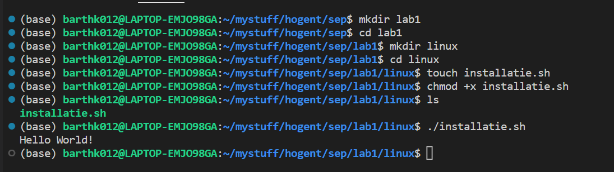

# labo 1

## Linux




| Taak | Commando |
|------|-----------|
| Een lijst tonen van de software die nu geinstalleerd is via apt | apt list --installed |
| Alle packages die nu geinstalleerd zijn bijwerken tot de laatste versie | sudo apt update && sudo apt upgrade -y |
| Via de console een package opzoeken | apt list "name" -a |
| Een geinstalleerde applicatie verwijderen | sudo apt remove "name" |

### Script

Aangezien Linux in WSL loopt en vooral Windows of evtl. MacOS voor SEL gaan gebruikt worden. Een verkorte versie van het script:

```bash
#! /bin/bash
# Automatiseren van Software installatie

echo "=== Bijwerken lijst beschikbare applicaties ==="
sudo apt -y update

echo "=== Algemene applicaties ==="
echo "### Nothing to install now ###"
```

## Mac

### Script

```bash
#! /bin/bash

# Automatiseren software-installatie
echo "=== Dit script installeert de nodige software voor Sys Engineering Lab ==="

brew install --cask virtualbox
brew install --cask cyberduck
brew install --cask mysqlworkbench
````
### resultaat

```bash
(base) barts-mbp:macOS bartheerkens$ ./installatie.sh 
=== Dit script installeert de nodige software voor Sys Engineering Lab ===
Running `brew update --auto-update`...
==> Auto-updated Homebrew!
Updated 1 tap (heroku/brew).

You have 5 outdated formulae installed.
You can upgrade them with brew upgrade
or list them with brew outdated.

Warning: Cask 'virtualbox' is already installed.

To re-install virtualbox, run:
  brew reinstall --cask virtualbox
==> Downloading https://update.cyberduck.io/Cyberduck-8.5.6.39394.zip
==> Downloading from https://a48823c7ec3cf4539564-60c534a1284a12ce74ef84032e9b4e46.ssl.cf1.rackcdn.com/Cyberduck-8.5.
######################################################################## 100.0%
==> Installing Cask cyberduck
==> Moving App 'Cyberduck.app' to '/Applications/Cyberduck.app'
🍺  cyberduck was successfully installed!
==> Downloading https://cdn.mysql.com/Downloads/MySQLGUITools/mysql-workbench-community-8.0.32-macos-x86_64.dmg
######################################################################## 100.0%
==> Installing Cask mysqlworkbench
==> Moving App 'MySQLWorkbench.app' to '/Applications/MySQLWorkbench.app'
🍺  mysqlworkbench was successfully installed!
```

## Windows

### Vragen
- **Powershell Prompt**: c:\windows\system32
- **Mijn script**: \\\wsl.localhost\Ubuntu-22.04\home\barthk012\mystuff\hogent\SEP\lab1\windows
- **Script in Screenshot**: D:\Users\BertVV\Documents\HoGent\SELab\Installatie.ps1

### Chocolatey
*gebruik ik persoonlijk al langer als package manager*

| Taak | Commando |
|------|-----------|
| Een lijst tonen van de software die nu geinstalleerd is via chocolatey | choco list -l |
| Alle packages die nu geinstalleerd zijn bijwerken tot de laatste versie | choco upgrade all |
| Via de console een package opzoeken | choco find "name" of choco search "name" |
| Een geinstalleerde applicatie verwijderen | choco uninstall "name" |

#### Script

```powershell
# Automatiseren software-installatie

Write-Host "Installatie SEL applicaties" 

choco install filezilla -y
choco install mysql.workbench -y
```

#### Result

```Powershell
PS C:\WINDOWS\system32> \\wsl.localhost\Ubuntu-22.04\home\barthk012\mystuff\hogent\SEP\lab1\windows\installatie.ps1
Installatie SEL applicaties
Chocolatey v1.3.0
Installing the following packages:
filezilla
By installing, you accept licenses for the packages.
Progress: Downloading filezilla 3.63.2... 100%

filezilla v3.63.2 [Approved]
filezilla package files install completed. Performing other installation steps.
Installing 64-bit filezilla...
filezilla has been installed.
  filezilla may be able to be automatically uninstalled.
 The install of filezilla was successful.
  Software installed to 'C:\Program Files\FileZilla FTP Client'

Chocolatey installed 1/1 packages.
 See the log for details (C:\ProgramData\chocolatey\logs\chocolatey.log).
Chocolatey v1.3.0
Installing the following packages:
mysql.workbench
By installing, you accept licenses for the packages.
Progress: Downloading mysql.workbench 8.0.31... 100%

mysql.workbench v8.0.31 [Approved]
mysql.workbench package files install completed. Performing other installation steps.
Downloading mysql.workbench
  from 'https://cdn.mysql.com/Downloads/MySQLGUITools/mysql-workbench-community-8.0.31-winx64.msi'
Progress: 100% - Completed download of C:\Users\bart_\AppData\Local\Temp\chocolatey\mysql.workbench\8.0.31\mysql-workbench-community-8.0.31-winx64.msi (44.62 MB).
Download of mysql-workbench-community-8.0.31-winx64.msi (44.62 MB) completed.
Hashes match.
Installing mysql.workbench...
mysql.workbench has been installed.
  mysql.workbench may be able to be automatically uninstalled.
 The install of mysql.workbench was successful.
  Software installed as 'msi', install location is likely default.

Chocolatey installed 1/1 packages.
 See the log for details (C:\ProgramData\chocolatey\logs\chocolatey.log).
 ```


